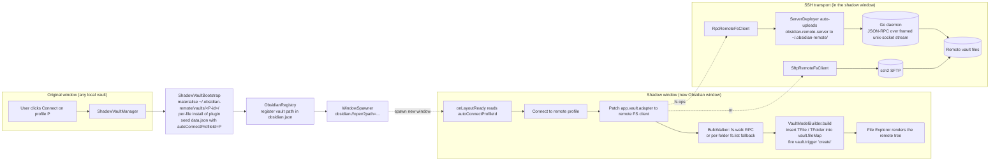

# Remote SSH for Obsidian

[](https://github.com/sotashimozono/obsidian-remote-ssh/actions/workflows/ci.yml)
[](https://github.com/sotashimozono/obsidian-remote-ssh/actions/workflows/integration.yml)
[](https://github.com/sotashimozono/obsidian-remote-ssh/actions/workflows/security.yml)
[](https://codecov.io/gh/sotashimozono/obsidian-remote-ssh)

[](https://github.com/sotashimozono/obsidian-remote-ssh/releases)
[](https://github.com/sotashimozono/obsidian-remote-ssh/releases)
[](https://github.com/sotashimozono/obsidian-remote-ssh/issues)

[](LICENSE)
[](https://obsidian.md)
[](https://go.dev)
[](https://nodejs.org)


> **A VS Code Remote-SSH-style experience for Obsidian.** Open a vault that
> lives on a remote SSH host, edit it from a real Obsidian window. Files,
> attachments, search, and live updates — all served from the remote,
> transparently.
>
> _Status: pre-1.0. End-to-end against Linux + macOS remotes with the bundled
> Go daemon. Install only into a dev vault for now; production use after v1.0._

---

## What you can do

- **Edit a remote vault as if it were local.** SSH in to your home server,
  cloud VPS, or work box. The vault stays on the remote; you get the full
  Obsidian editor experience locally — no manual `rsync`, no Dropbox dance.
- **Use the plugins you already love.** Dataview, Templater, Excalidraw,
  Tasks, and most plugins that go through Obsidian's vault API work
  unchanged. (Compatibility matrix:
  [docs/plugin-compatibility.md](docs/plugin-compatibility.md).)
- **Edit from multiple machines.** Live updates push between connected
  clients via `fs.watch`; conflicting saves trigger a 3-way merge UI
  with ancestor / mine / theirs panes.
- **Survive flaky networks.** Disconnects spool writes into an offline
  queue; reconnect drains them automatically. The status bar shows the
  pending count.
- **Bring your own SSH setup.** Password, private key, agent forwarding,
  jump host (`ProxyJump`) — all use the same `~/.ssh/config` your
  terminal does.

---

## Install

> ⚠️ The plugin is not yet in the Obsidian community plugin browser. Install
> manually from a GitHub Release (BRAT support is on the roadmap; until
> then, the steps below are the supported path).

### 1 — Download the latest release

Go to the [Releases page](https://github.com/sotashimozono/obsidian-remote-ssh/releases),
find the most recent tag, and download:

- `main.js`
- `manifest.json`
- `styles.css`
- one daemon binary matching your **remote** OS + architecture:
  - `obsidian-remote-server-linux-amd64`
  - `obsidian-remote-server-linux-arm64`
  - `obsidian-remote-server-darwin-amd64`
  - `obsidian-remote-server-darwin-arm64`

The daemon binary is what the plugin auto-uploads to your remote on first
connect. The OS/arch picks the binary that runs on the **remote**, not on
the machine where Obsidian is installed.

### 2 — Drop the files into your vault

Create the plugin folder and place the files like this:

```text
<your-vault>/
  .obsidian/
    plugins/
      remote-ssh/
        main.js
        manifest.json
        styles.css
        server-bin/
          obsidian-remote-server-linux-amd64    ← rename / pick yours
```

### 3 — Enable in Obsidian

Settings → Community plugins → "Installed plugins" → toggle **Remote SSH**
on. Reload the vault if Obsidian doesn't pick it up immediately.

### Verifying the daemon (optional but recommended)

Daemon binaries are signed with [Sigstore cosign](https://www.sigstore.dev/)
keyless OIDC. Verify any release binary independently before trusting it on
your remote — see [SECURITY.md](SECURITY.md#verifying-release-artefacts) for
the one-line `cosign verify-blob` command.

The plugin also runs a sha256 round-trip check on every deploy and refuses
to start a daemon that doesn't match.

---

## Quickstart

About **3 minutes** if you already have an SSH host.

1. **Add a profile.** Settings → Remote SSH → "+ Add". Fill in host, port,
   username, auth method (`privateKey` / `password` / `agent`), transport
   (`RPC` recommended), and the **remote vault path** (relative paths
   resolve under `$HOME` — `notes/main` → `~/notes/main`).
2. **Click Connect** on the profile row, or run **Remote SSH: Connect to
   remote vault** from the command palette.
3. **A new Obsidian window appears.** That window is your "shadow vault" —
   the same UI you know, but every file you see lives on the remote. Start
   editing.

To leave: close the shadow window, or run **Remote SSH: Disconnect from
remote vault** inside it. The original window is never touched.

---

## Features

| Feature | Notes |
| --- | --- |
| 🪟 **Shadow vault opens in a new Obsidian window** | The window you started from is untouched; the remote vault is its own first-class window with its own File Explorer, search, command palette. |
| ⚡ **Sub-second cold-open even for 10k-file vaults** | Single `fs.walk` RPC fetches the whole tree in one round-trip. Falls back to per-folder `fs.list` for SFTP transport or older daemons. |
| 🖼️ **Image / PDF / video rendering via ResourceBridge** | Local HTTP server (random localhost port + bearer token) serves binary content to the Obsidian webview. Image extensions go through `fs.thumbnail` with a 200 MB on-disk LRU cache. |
| 🔁 **Live multi-client sync** | `fs.watch` notifies every connected client when another writer changes a file; the file explorer + open editors update within ~1 s. |
| 🪢 **3-way conflict resolution** | If the remote mtime moved under your edit, the plugin opens a `ThreeWayMergeModal` with ancestor / mine / theirs panes. Plain text only; binary falls back to a 2-choice modal. |
| 📥 **Offline write queue** | Writes during a disconnect spool to a JSONL queue under `<vault>/.obsidian/plugins/remote-ssh/queue/`; reconnect drains them automatically. Status bar shows the pending count. |
| 🔐 **Cosign-signed daemon binaries** | Every release binary ships with a Sigstore bundle (`.bundle`). Verify provenance via `cosign verify-blob`; the plugin also runs a sha256 round-trip check on every deploy. |
| 🩹 **Automatic reconnect with backoff** | SSH drops trigger a retry loop (default 5 attempts, exponential backoff up to 30 s). Reads served from the in-memory cache during the retry; writes spool to the offline queue. |
| 🪪 **Per-client subtree (PathMapper)** | UI-state files (`workspace.json`, `cache/`, `graph.json`, etc) are routed to a per-device subtree on the remote so two machines don't clobber each other's tab layout. |
| 🔌 **Jump host / `ProxyJump` support** | Multi-hop SSH through bastion hosts. Works with the same `~/.ssh/config` your terminal already uses. |

---

## Settings

| Setting | Default | What it does |
| --- | --- | --- |
| `Client ID` | sanitized OS hostname | Per-device subtree on the remote (`.obsidian/user/<id>/`). Holds workspace + UI state — anything not safe to share between machines. |
| `User name` | OS username | Cosmetic — surfaces in the connect notice as `<user>@<host>`. |
| `Reconnect attempts` | `5` | How many times to retry before giving up. Exponential backoff up to 30 s. `0` disables auto-reconnect. |
| `Debug logging` | `false` | Adds `debug`-level lines to the JSONL log file (see Troubleshooting). |

---

## Plugin compatibility

The shadow vault patches `app.vault.adapter` so plugins that go through
Obsidian's vault API work transparently. Plugins that **bypass** the
adapter — typically by importing Node `fs` directly, joining paths against
`app.vault.adapter.basePath`, or using internal Obsidian APIs we don't
intercept — read or write the local empty shadow directory instead and
effectively don't see your remote vault.

The full matrix is in
[docs/plugin-compatibility.md](docs/plugin-compatibility.md). Short summary:

- ✅ **Most read-side plugins** — Dataview, Tasks, Calendar, Outliner, …
- ✅ **Most write-side plugins** — Templater, Daily Notes, Quick Switcher++, …
- ✅ **Image-rendering plugins** — Excalidraw, Image Toolkit (RPC transport only).
- ⚠️ **fs-direct plugins** — Omnisearch (uses Node `fs` for indexing), some
  media-importer plugins. These read the empty local shadow dir.

---

## Troubleshooting

The console log is the first thing to check. Path:

```text
<shadow-vault>/.obsidian/plugins/remote-ssh/console.log
```

For a shadow vault, that's typically:

```text
~/.obsidian-remote/vaults/<profile-id>/.obsidian/plugins/remote-ssh/console.log
```

It's **JSONL** (one event per line). Pipe through `jq` for fast triage:

```bash
# Just the errors
jq 'select(.level == "error")' console.log

# Everything from a particular subsystem
jq 'select(.fields.category == "auth")' console.log

# Last 20 lines, one-line per
tail -20 console.log | jq -c '{ts, level, msg}'
```

Common issues:

- **"daemon binary not staged"** — the binary file inside `server-bin/`
  is missing or doesn't match your remote OS / arch. Re-download from the
  release that matches your installed plugin version.
- **No new window opens after Connect** — the shadow vault wasn't
  registered with Obsidian. Look for an `ObsidianRegistry` write error in
  the source-window console log (commonly a permissions issue on the
  Obsidian config dir). Reopen Settings and click Connect again.
- **Shadow window opens but File Explorer is empty** — the auto-connect
  failed. Open the shadow window's console log; look for `BulkWalker` or
  `populateVaultFromRemote` errors. Try **Remote SSH: Reconnect to remote**
  from the command palette inside the shadow window.
- **Reconnect spins forever then fails** — `Reconnect attempts` is set
  too high or the remote really is down. Set it lower (or `0` for
  fail-fast).
- **Images / PDFs don't render** — ResourceBridge needs `RPC` transport.
  Check the active profile's transport setting.
- **`N pending offline edits` won't go away** — the replay is hitting a
  conflict on every entry. Click the status-bar indicator to open the
  pending-edits modal and inspect; discard if appropriate.

---

## Security

Daemon binaries are signed with Sigstore cosign keyless OIDC; the plugin
verifies the upload with sha256 round-trip on every deploy.

To **report a vulnerability**, please use a private GitHub Security
Advisory — full policy in [SECURITY.md](SECURITY.md). Do **not** open a
public issue for security bugs.

---

## Contributing

Contributions welcome. Dev setup, branch + commit conventions, version-bump
mechanic, and how to run the full test suite are in
[CONTRIBUTING.md](CONTRIBUTING.md).

Issues for bug reports + feature requests are at
[github.com/sotashimozono/obsidian-remote-ssh/issues](https://github.com/sotashimozono/obsidian-remote-ssh/issues).

---

## How it works (technical)



Two transports per profile:

- **`RPC` (recommended).** The plugin uploads a small Go daemon
  (`obsidian-remote-server`) to `~/.obsidian-remote/` on the remote and
  starts it via `nohup`. A local Duplex stream is forwarded to the
  daemon's unix socket; vault FS ops flow as length-framed JSON-RPC.
  Required for the ResourceBridge (image / PDF / video rendering),
  `fs.walk` (sub-second cold-open), `fs.thumbnail` (image cache), and
  `fs.watch` (live updates from other clients).
- **`SFTP`.** Direct SFTP over `ssh2`, no daemon. Works without any
  remote-side install but loses the daemon-only features above.

Why a separate window: Obsidian doesn't expose a public path to "rebuild
the vault model from a different adapter mid-session." The shadow window's
vault is constructed from the remote tree at startup, so every plugin in
that window sees a normal-looking vault from frame zero. The full design
and the smoke evidence behind it are in
[docs/architecture-shadow-vault.md](docs/architecture-shadow-vault.md).

The performance machinery (`BulkWalker`, `fs.thumbnail` cache) is
documented in [docs/architecture-perf.md](docs/architecture-perf.md);
the conflict + offline-queue design is in
[docs/architecture-collab.md](docs/architecture-collab.md); the test
strategy is in [docs/testing-strategy.md](docs/testing-strategy.md).

---

## Acknowledgements

Inspired by VS Code's Remote-SSH model. The wire format is an LSP-style
framed JSON-RPC over a unix-socket-forwarded stream — the same shape
language servers use, just for filesystem ops.
