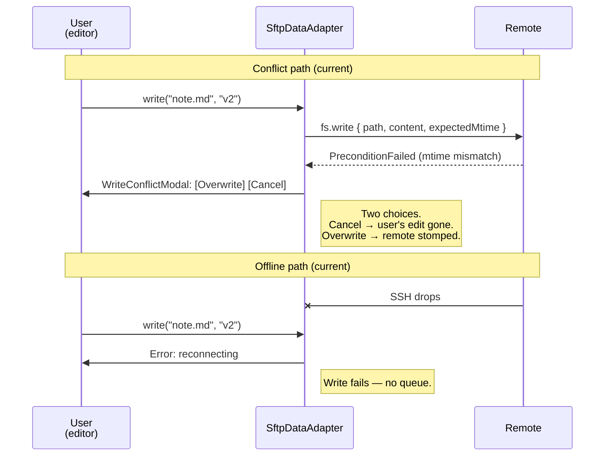
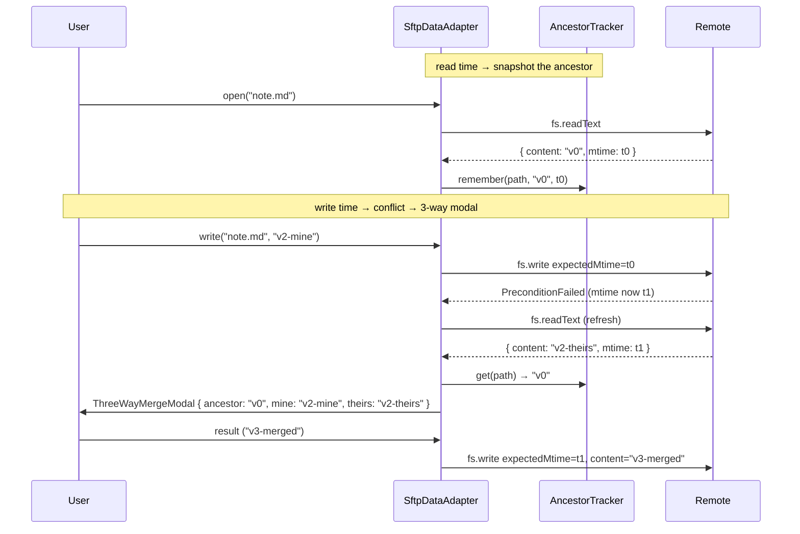
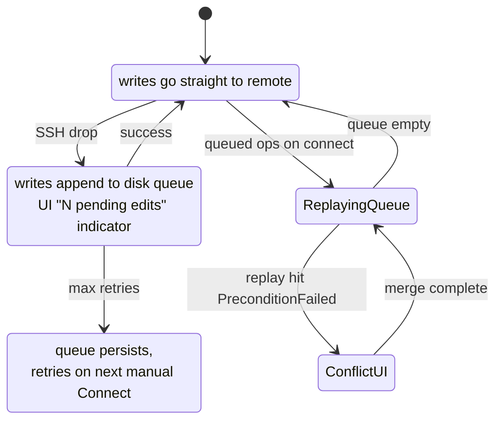

# Architecture: collab safety epic (E2)

This doc records the design for the conflict + offline-resilience
epic landing in v0.4.29 onwards. Companion to
[architecture-shadow-vault.md](./architecture-shadow-vault.md) and
[architecture-perf.md](./architecture-perf.md).

## Goals

- **G-α** A user editing a file that another client (or the same
  client from another window) modified while they were typing
  doesn't silently lose their work. The conflict surfaces as a
  3-way diff with three real choices, not the current
  overwrite-or-cancel two-shot.
- **G-β** A write that lands during an SSH disconnect (or the
  reconnect-waiting state) is queued, not rejected. The user keeps
  typing; the queue replays after the session recovers; conflicts on
  replay route through the same 3-way UI.

## Today's hotspots



## E2-α — 3-way merge



### Functional requirements

| ID | Requirement |
|---|---|
| α1 | `AncestorTracker`: on read / readText, cache (path → content, mtime). On write success, refresh. LRU on byte size with a configurable cap (default 64 MB). Per-session, never persisted. |
| α2 | `ThreeWayMergeModal`: 3-pane diff UI (ancestor / mine / theirs). Choices: "Keep mine", "Keep theirs", "Edit merged", "Cancel". Plain-text only. |
| α3 | SftpDataAdapter `write` / `writeBinary` on PreconditionFailed pulls ancestor from the tracker and surfaces the modal. Binary paths skip the 3-way and reuse the existing two-choice `WriteConflictModal` (binary diff isn't a useful UI). |

## E2-β — offline write queue



### Functional requirements

| ID | Requirement |
|---|---|
| β1 | `OfflineQueue`: persistent JSONL at `<vault>/.obsidian/plugins/remote-ssh/queue/`, one op per line, total-ordered. Supported ops: write / writeBinary / append / mkdir / remove / rmdir / rename / copy. |
| β2 | SftpDataAdapter in `reconnecting` state pushes write-side ops to the queue, returns success synthetically + writes to local cache so editor reads stay coherent. Read-side ops continue to read-from-cache or error if not cached. |
| β3 | `QueueReplayer`: on connection recovery, drains the queue serially against the remote. PreconditionFailed → α3 path (3-way modal). Success → next op. Failure surfaces as a notice; remaining queue stays. |
| β4 | StatusBar shows "N pending offline edits" while the queue is non-empty; clicking opens `PendingEditsModal` listing the pending ops with the option to discard. |

## Non-functional / constraints

- **N1** AncestorTracker is in-memory only. Cleared on disconnect /
  restoreAdapter. A "stale ancestor" after a long disconnect is
  acceptable — the next read refreshes it.
- **N2** OfflineQueue is persistent across Electron restarts. JSONL
  was picked over SQLite to keep the on-disk format human-inspectable
  for debugging.
- **N3** Read-side ops (`read`, `readBinary`, `list`, `stat`) are
  never queued. They serve from cache when possible and error
  otherwise; queueing them would mislead the editor about file
  presence.
- **N4** Large binary writes can balloon the queue dir. Cap total
  queue bytes (default 500 MB); over-cap writes are rejected with a
  visible notice rather than silently truncated.
- **N5** Three-way merge is plain-text only. Binary conflicts continue
  through the existing two-choice `WriteConflictModal`.

## Module split

```
plugin/src/
├── conflict/
│   ├── AncestorTracker.ts          (new) — α1
│   └── DiffEngine.ts               (new) — α2 internal, plain-text Myers diff
├── offline/
│   ├── OfflineQueue.ts             (new) — β1, β2
│   └── QueueReplayer.ts            (new) — β3
├── ui/
│   ├── ThreeWayMergeModal.ts       (new) — α2
│   └── PendingEditsModal.ts        (new) — β4
├── adapter/SftpDataAdapter.ts      (modify) — α3, β2 hooks
├── transport/ReconnectManager.ts   (modify) — β3 trigger
└── ui/StatusBar.ts                 (modify) — β4
```

## Phased PRs

| PR | Content | Independent? |
|---|---|---|
| **E2-α.1** | AncestorTracker + LRU + tests + this doc | ✅ |
| **E2-α.2** | DiffEngine (Myers) + ThreeWayMergeModal + tests | depends on α.1 (uses ancestor from tracker indirectly via test fixtures) |
| **E2-α.3** | SftpDataAdapter conflict hook (read remembers, PreconditionFailed routes through tracker + modal) + tests | depends on α.1 + α.2 |
| **E2-β.1** | OfflineQueue persistent JSONL + tests | ✅ |
| **E2-β.2** | SftpDataAdapter reconnecting → queue push + tests | depends on β.1 |
| **E2-β.3** | QueueReplayer + ReconnectManager integration; replay PreconditionFailed routes through α.3 | depends on β.2 + α.3 |
| **E2-β.4** | StatusBar pending-edits indicator + PendingEditsModal | depends on β.1 |

α and β can land in either order at the start; β.3 needs α.3 only
because that's where conflict-on-replay surfaces. The path of least
risk is α-first.

## Defaults

| Knob | Value | Rationale |
|---|---|---|
| AncestorTracker max bytes | 64 MB | Matches `ReadCache` — same scarce resource (process memory). |
| OfflineQueue max bytes | 500 MB | Big enough for a multi-day disconnect with typical text edits + a few attachments; small enough that a stuck queue doesn't quietly consume the disk. |
| Queue dir | `<vault>/.obsidian/plugins/remote-ssh/queue/` | Lives with the plugin's other state so a vault move carries it. |
| Diff engine | Hand-rolled Myers, ~150 LoC | No npm dep — bundle-size guard stays comfortable. |

## Verification approach

- Unit tests for each new module (AncestorTracker, DiffEngine,
  OfflineQueue, QueueReplayer) — same patterns as the existing
  `*.test.ts` files.
- α.3 + β.3 land with adapter-level tests: read → simulated
  PreconditionFailed → modal callback fires with the right ancestor;
  reconnecting → write → queue grows → recover → queue drains.
- Manual smoke on the dev vault: edit the same note from two
  shadow-vault windows pointed at the same remote; conflict modal
  should appear with the right three panes.
