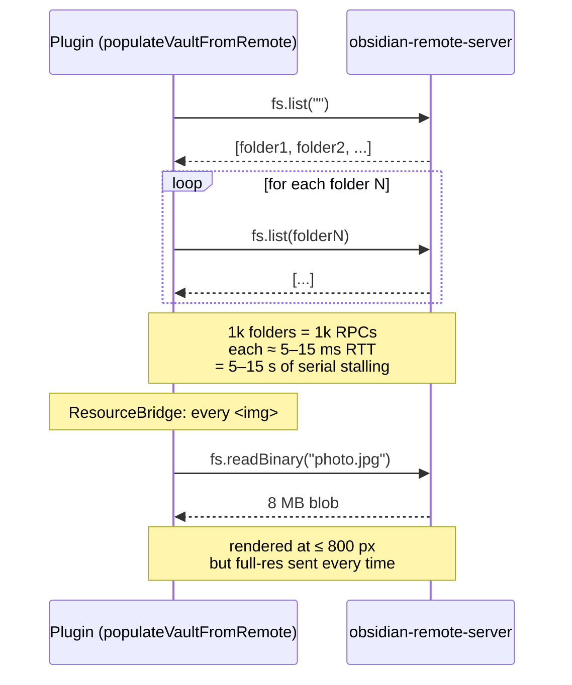
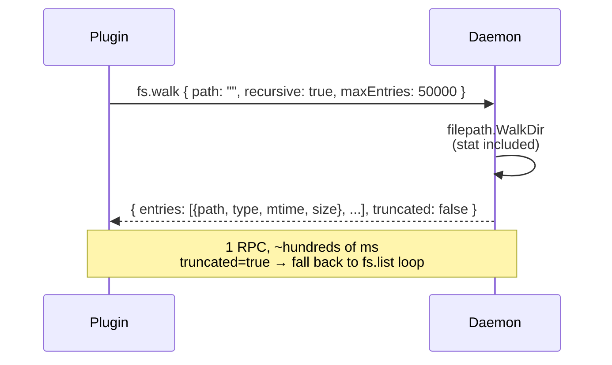
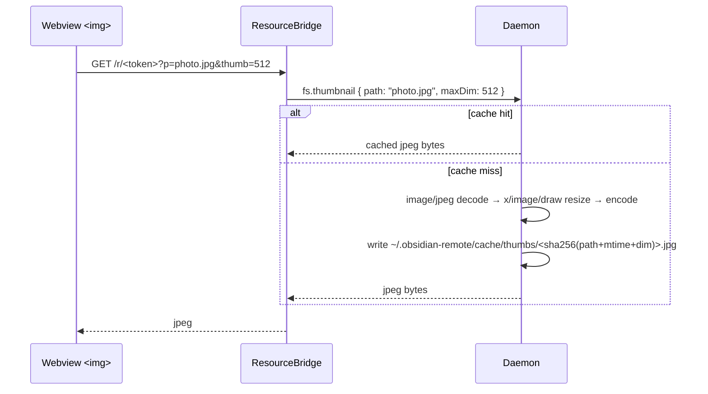

# Architecture: performance epic (E1)

This doc is the design record for the performance epic that lands in
v0.4.23 onwards. It complements
[architecture-shadow-vault.md](./architecture-shadow-vault.md) (the
overall architecture) and [testing-strategy.md](./testing-strategy.md)
(how the epic gets verified).

## Goals

- **G-α** Cold-open of a typical (≤ 10k file) vault takes < 2 s
  end-to-end. Today the same path is dominated by O(folders) RPC
  round-trips during `populateVaultFromRemote`, often 10s of seconds
  on a real network.
- **G-β** Image-heavy vaults stay snappy. Today the ResourceBridge
  fetches the full original binary every time `` resolves a
  remote asset; an 8 MB camera shot is sent over the wire on every
  scroll into view.

## Today's hotspots



## E1-α — bulk walk

A new `fs.walk` RPC method on the daemon: one round-trip that returns
a flat list of every entry under a given path with mtime + size
already populated. The shadow-vault cold-open path
(`populateVaultFromRemote`) switches to it; per-folder `fs.list` is
kept as a fallback for old daemons or when `Truncated: true` comes
back.



### Functional requirements

| ID | Requirement |
|---|---|
| F-α1 | Daemon `fs.walk` RPC returns `{ entries, truncated }` where each entry is `{ path (vault-relative), type, mtime, size }`. Stat is included; no follow-up `fs.stat` round-trip needed. |
| F-α2 | `populateVaultFromRemote` is rewritten on top of `fs.walk`. If the daemon returns `truncated: true` or doesn't advertise `fs.walk`, the legacy per-folder traversal kicks in. |
| F-α3 | The SFTP transport stays on the per-folder list path; `fs.walk` is RPC-only. |

### Non-functional / constraints

- **N-α1** Response payload soft-limit: ~10 MB. At ~150 B/entry that's 50k
  entries — comfortable headroom for typical vaults.
- **N-α2** Symlinks are reported as `EntryTypeSymlink` and not followed,
  matching `fs.list`'s policy. Permission errors on a subtree are
  swallowed (`fs.SkipDir`) so a stray protected folder doesn't kill
  the walk; other errors abort and surface.
- **N-α3** Backwards compat: a plugin talking to an older daemon that
  doesn't advertise `fs.walk` falls back transparently — no breaking
  change.

## E1-β — thumbnail cache

A new `fs.thumbnail` RPC method on the daemon: decode → resize →
re-encode an image once, cache the result on disk, serve subsequent
requests from cache. The plugin's ResourceBridge picks up the
`fs.thumbnail` path for image extensions; click-to-zoom paths still
resolve via `fs.readBinary` so users get full quality on demand.



### Functional requirements

| ID | Requirement |
|---|---|
| F-β1 | Daemon `fs.thumbnail` RPC accepts `{ path, maxDim }` and returns a JPEG-encoded resize. JPG and PNG sources land in the first PR; WEBP and HEIC are deferred. |
| F-β2 | Disk cache lives under `~/.obsidian-remote/cache/thumbs/`. Key is `sha256(path + mtime + maxDim)`, so a source-file edit invalidates the cached thumbnail automatically. |
| F-β3 | The plugin's ResourceBridge routes image-extension requests to `fs.thumbnail`; click-to-zoom and other "I want the original" code paths keep using `fs.readBinary`. |
| F-β4 | The cache caps total size (default 200 MB) and evicts least-recently-used entries first. |

### Non-functional / constraints

- **N-β1** Resize lib must be cgo-free so the daemon binary stays
  cross-compilable from any host. Plain Go: `image/jpeg`, `image/png`,
  `golang.org/x/image/draw`. HEIC needs cgo; defer.
- **N-β2** Daemon binary size grows by ~1.5 MB after pulling in the
  image libs. Plugin bundle (<600 KB guard) is unaffected.
- **N-β3** Backwards compat as in α: an older daemon without
  `fs.thumbnail` makes ResourceBridge transparently fall back to
  `fs.readBinary`.

## Module split

### Server (Go)
```
server/internal/handlers/
├── fs_walk.go            (new) — F-α1
├── fs_walk_test.go       (new)
├── fs_thumbnail.go       (new) — F-β1, F-β2
└── thumbnails/
    ├── cache.go          (new) — disk cache + LRU eviction
    └── resize.go         (new) — image decode/resize/encode
```

### Plugin (TypeScript)
```
plugin/src/
├── proto/types.ts            (extend) — WalkParams/Result, ThumbnailParams/Result
├── adapter/
│   ├── RpcRemoteFsClient.ts  (extend) — walk(), thumbnail()
│   ├── ResourceBridge.ts     (extend) — F-β3: image extensions hit thumbnail
│   └── BulkWalker.ts         (new) — F-α2: fs.walk + fallback orchestration
└── main.ts                   (modify) — populateVaultFromRemote uses BulkWalker
```

## Phased PRs

| PR | Content | Independent? |
|---|---|---|
| **E1-α.1** | proto types + daemon `fs.walk` handler + Go tests + this doc | ✅ |
| **E1-α.2** | plugin `RpcRemoteFsClient.walk()` + `BulkWalker` + `populateVaultFromRemote` switch + unit tests | depends on α.1 |
| **E1-α.3** | integration test: RPC walk vs per-folder list output equivalence + a benchmark | depends on α.1 + α.2 |
| **E1-β.1** | daemon `fs.thumbnail` handler + image resize (no cache yet, in-memory only) | ✅ |
| **E1-β.2** | disk cache + LRU eviction + unit tests | depends on β.1 |
| **E1-β.3** | plugin `RpcRemoteFsClient.thumbnail()` + ResourceBridge integration + image-rendering e2e | depends on β.1 (β.2 ideally) |
| **E1-β.4** | (optional) thumbnail metrics + Settings UI for cache size limit | depends on β.2 |

α and β are independent and can land in either order. Each PR stands
on its own — build/test green without later PRs.

## Defaults

| Knob | Value | Rationale |
|---|---|---|
| `fs.walk` MaxEntries | 50_000 | Typical Obsidian vault is in the 1k-10k file range; this leaves an order-of-magnitude headroom and bounds payload to ~10 MB. |
| Thumbnail maxDim default | 1024 px | Crisp on Retina without sending camera-original sizes. An 8 MB JPEG resizes to ~150 KB. |
| Thumbnail format | JPEG q=80 | Best compatibility / size trade-off. Source PNG with alpha falls back to PNG to preserve transparency (β.1 detail). |
| Thumbnail cache size | 200 MB | ~1500 photos at the default size; tuneable via Settings (β.4). |
| Cache TTL | none (LRU only) | Cache key already encodes mtime, so stale-by-edit is impossible; LRU evicts cold entries. |

## Verification approach

- Unit tests for each handler (Go side) and each new plugin module
  (TypeScript side) — same patterns as the existing `*_test` files.
- Integration test (E1-α.3) confirms `fs.walk` returns the same set of
  paths as the legacy per-folder traversal against the same vault, so
  the migration is a behaviour-preserving optimization.
- A small benchmark (E1-α.3) records the wall-clock difference for the
  docker test vault — useful to keep regression-aware as the daemon
  evolves.
- E1-β.3 lands with an end-to-end check that an `` tag in a note
  resolves through the bridge and renders the thumbnail (verified via
  the existing dev vault flow).
