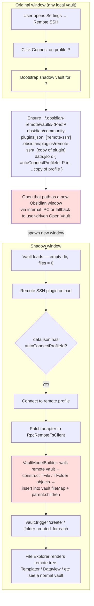

# Architecture: Shadow Vault Approach

**Status:** Phases 0–6A shipped end-to-end (v0.4.14). Phase 6B (this docs polish) in flight; Phase 6C (plugin compatibility re-verification) pending.
**Decided:** 2026-04-27
**Supersedes:** the monkey-patch-and-reconcile approach used through v0.4.3

## TL;DR

To deliver a VS Code Remote-SSH-like experience for Obsidian, we open the
remote vault as a **second Obsidian window** rooted at a local "shadow"
directory that's empty on disk but whose plugin loads the file model
from the remote daemon at startup. This replaces the in-place
`monkey-patch app.vault.adapter + reconcileVaultRoot` flow used through
v0.4.3, which is fundamentally blocked on this Obsidian build (see
**Why we pivoted** below).

The transport stack — `RpcRemoteFsClient`, `SftpRemoteFsClient`,
`ServerDeployer`, `ResourceBridge`, `ReconnectManager`, `JumpHostTunnel`,
`AuthResolver`, `HostKeyStore`, the Go daemon, `fs.watch` — is unchanged.
What gets replaced is the surface that connects the patched adapter to
Obsidian's vault model.

---

## 1. Why we pivoted

Through v0.4.3 the design was: user opens any local vault, clicks
Connect, the plugin monkey-patches `app.vault.adapter` to route through
`RpcRemoteFsClient`, then `reconcileVaultRoot()` walks the remote tree
and calls `app.vault.adapter.reconcileFile(path)` for every file so
Obsidian's vault model picks up the new contents.

PRs #52, #54, #57 each tried a variation of this. None of them work on
the user's Obsidian build (1.5+ era, FileSystemAdapter on desktop). The
2026-04-27 smoke session ran end-to-end devtools experiments and
established:

| API tried | Result on this build |
|---|---|
| `reconcileFile(vaultPath)` (PR #57) | subscriber throws `Cannot read properties of undefined (reading 'startsWith')` |
| `reconcileFile(getRealPath(vaultPath))` (constructed via Obsidian's own helper) | same throw |
| `reconcileFileInternal(vaultPath)` | different throw — `lastIndexOf of undefined` |
| `vault.generateFiles()` | returns an async iterator that does nothing useful for our purpose |
| `vault.load()` after clearing `vault.fileMap` | runs in 1.7s and completes, but rebuilds **zero** files; `vault.load()` does not walk the adapter |

Catastrophic-mismatch state from a real connect attempt:

- Adapter is patched and points at remote.
- Vault model still reflects local files (the reconcile attempts were
  no-ops: 0 added, 0 pruned).
- File Explorer therefore shows the local layout.
- Any read attempt — Templater scanning, Dataview indexing, the user
  clicking a file — flows through the patched adapter to remote, which
  doesn't have those local paths, producing an `unhandledrejection: no
  such file: …` storm.

Conclusion: Obsidian does not expose a public path to "rebuild the
vault model from a different adapter mid-session." The reconcile
methods exist but their event subscribers are coupled to internal state
the patched adapter can't satisfy after the vault has already been
constructed against a different basePath.

So we stop trying to update the vault in place, and instead spin up a
**fresh** vault whose adapter is set up from the very first read.

## 2. Architecture



Yellow = new component.
Red = open question / unverified mechanism (see §4).

## 3. Components

| Module | Status | Responsibility |
|---|---|---|
| `ShadowVaultBootstrap` | shipped (PR #64, MERGE strategy in #65 + #67) | Materialise `~/.obsidian-remote/vaults/<profile-id>/` for a profile: ensure `.obsidian/`, install plugin (per-file symlink chain — see OQ4), write `data.json` with the profile config and `autoConnectProfileId` marker. |
| `ShadowVaultManager` | shipped (PR #64) | High-level: given a profile, decide whether shadow vault already exists, bootstrap if not, then ask `WindowSpawner` to open it. |
| `WindowSpawner` | shipped (PR #64) | Fires `obsidian://open?path=<vaultPath>` via `window.open`. Obsidian's URL handler accepts the path because `ObsidianRegistry` registered it (see OQ1). |
| `ObsidianRegistry` | shipped (PR #64) | Reads/atomically rewrites `obsidian.json` (Obsidian's per-user vault list). Idempotent register; preserves unknown top-level keys; per-OS resolution via `os.homedir()` / env vars. |
| `VaultModelBuilder` | shipped (PR #61, fixes #62/#63/#68; mutators in #70) | The single source of truth for vault-model writes. `build(entries)` for the bulk initial fill on connect; `insertOne` / `removeOne` / `modifyOne` / `renameOne` for incremental fs.watch-driven updates. Constructs `TFile` / `TFolder` via injected constructors (see OQ2). |
| `RpcRemoteFsClient` | unchanged | Existing α (Go daemon) RPC transport. |
| `SftpRemoteFsClient` | unchanged | Existing direct-SFTP fallback. |
| `ServerDeployer` | unchanged | Auto-deploys the daemon (0.4.2 absolute paths + 0.4.3 suffix-pkill fixes both apply). |
| `ResourceBridge` | unchanged | localhost HTTP server for binaries, with Range support. |
| `ReconnectManager` | unchanged | Exp-backoff reconnect; runs inside the shadow window the same way. |
| `JumpHostTunnel`, `AuthResolver`, `HostKeyStore` | unchanged | All transport-layer, profile-driven. |
| `reconcileVaultRoot` (main.ts) | **deleted** (PR #69) | Replaced by `VaultModelBuilder.build`. |
| `reconcileVaultPath` + `lookupIsFolder` + `ReconcileCapableAdapter` (main.ts) | **deleted** (PR #70) | Replaced by `VaultModelBuilder.{insertOne,removeOne,modifyOne,renameOne}`; killed the last live caller of the broken Obsidian private API. |
| `autoPatchAdapter` setting + flow (Tier 1-A, PR #46) | **deleted** (PR #69) | The shadow window patches its own adapter at onload; there's no "auto-patch on first connect" anymore — the shadow window IS the connect. |
| `debugDumpVaultAdapterAPI` + `debug-dump-api` command (PR #54) | **deleted** (PR #69) | Diagnostic served its purpose during the v0.4.x smoke. |
| `debugBuildVaultFromRemote` + `debug-build-vault-from-remote` command (Phase 1 POC) | **deleted** (PR #69) | Replaced by the always-on auto-connect path inside the shadow window. |
| `debugOpenShadowVault` + `debug-open-shadow-vault` command (Phase 2 POC) | **deleted** (PR #69) | Replaced by the Settings UI Connect button. |

## 4. Open questions

These need to be answered before or during early-phase implementation.
Each has a concrete way to verify.

### OQ1 — How does Obsidian programmatically open a vault path in a new window?

**Risk:** High. If there's no public/internal API, the UX degrades to
"click Open Vault, pick this folder", which hurts the
remote-SSH-feels-magical effect.

**Status (2026-04-27):** ✅ **Answered.** Use Obsidian's documented
`obsidian://open?path=<absolute-path>` URL scheme. For an
*unregistered* path the URL falls back to the vault picker dialog;
for a *registered* path Obsidian opens it directly in a new window.
So `ShadowVaultBootstrap` registers the shadow vault in
`obsidian.json` (Obsidian's per-user vault list) before
`WindowSpawner` fires the URL.

`obsidian.json` schema (only the parts we touch):

```json
{
  "vaults": {
    "<hex16>": { "path": "...", "ts": <millis>, "open"?: true }
  }
}
```

Path per OS — `ObsidianRegistry.defaultConfigPath()` resolves at
runtime via env vars / `os.homedir()`:

| OS | Path |
|---|---|
| Windows | `%APPDATA%\obsidian\obsidian.json` |
| macOS | `~/Library/Application Support/obsidian/obsidian.json` |
| Linux | `$XDG_CONFIG_HOME/obsidian/obsidian.json` (default `~/.config`) |

`register()` is idempotent (returns the existing id if the path is
already there) and case-insensitive on Windows; writes are atomic
(temp file + rename) so Obsidian can't read a half-written config.

### OQ2 — Can we construct `TFile` / `TFolder` from the public `obsidian` module?

**Risk:** Medium. If the constructors throw or require properties we
can't supply, we have to construct quack-typed plain objects, and
plugin compatibility (`instanceof TFile` checks) gets fragile.

**Status (2026-04-27):** ✅ **Answered.** Construct as
`new TFile(vault, path)` and `new TFolder(vault, path)`, then
override the fields we control (`name`, `basename`, `extension`,
`parent`, `stat`).

`require('obsidian')` is not available in the devtools console (the
`obsidian` module is only resolved inside the esbuild-bundled plugin
code), so the verification grabs the class via an existing instance:

```js
const TFile   = Object.getPrototypeOf(app.vault.getFiles()[0]).constructor;
const TFolder = Object.getPrototypeOf(app.vault.getRoot()).constructor;
new TFile();                       // appeared OK in initial test
new TFolder();                     // → throws Cannot read properties of undefined (reading 'lastIndexOf')
new TFolder(app.vault, '.test');   // OK; auto-fills [parent, deleted, vault, path, name, children]
```

The TFolder constructor calls `path.lastIndexOf('/')` to derive
`name`; without an arg `path` is `undefined`. The TFile no-arg form
*appeared* OK in the OQ2 minimal test only because we never read the
auto-derived fields after construction. **Both must be constructed
with `(vault, path)`** — `VaultModelBuilder` does this.

From inside the bundled plugin we import the classes the normal way
(`import { TFile, TFolder } from 'obsidian'`) — only the devtools
probe needs the prototype trick. The constructors are dependency-
injected into `VaultModelBuilder` so unit tests can pass `FakeTFile`/
`FakeTFolder` (the `obsidian` package ships only `.d.ts`, no runtime).

### OQ3 — Does inserting into `vault.fileMap` + firing `vault.trigger('create', file)` make File Explorer render and downstream plugins (Templater, Dataview) treat the file as real?

**Risk:** Medium. The "broken subscribers" we saw earlier listened to
`change`/`raw` events on the **adapter**, not `create` on the vault.
But we should verify they don't also listen to `create`.

**Status (2026-04-27):** ✅ **Answered for File Explorer.** The
mechanism works — File Explorer renders the injected file at root.
There is a **plugin-compat caveat** for plugins that bypass the
adapter and read files via Node `fs` directly; this is now
documented in §6.5 and is acceptable as a known limitation.

The minimal test (run on a real vault, no remote connection):

```js
// after constructing `fake` per OQ2 above
app.vault.fileMap[fake.path] = fake;
app.vault.getRoot().children.push(fake);
app.vault.trigger('create', fake);
```

Observed:

- `app.vault.getFiles()` includes the new file ✅
- `app.vault.getAbstractFileByPath('POC-fake-file.md')` returns it ✅
- File Explorer renders `POC-fake-file.md` at root ✅
- The earlier `iu`/`nu` storm-throwing subscribers (which were on
  adapter `change`/`raw`) did **not** fire ✅
- 2 subscriber errors fired during `create` from Omnisearch trying
  to `fs.readFile('<basePath>/POC-fake-file.md')` and getting
  ENOENT — see §6.5 for handling.

**Open click-to-open:** the test was run on a disconnected vault, so
clicking the injected file failed (no patched adapter, file does not
exist on disk). We expect that with a patched adapter pointing at
remote, `vault.read()` → `adapter.read()` → remote round-trip will
succeed. To be re-verified during Phase 1.

### OQ4 — Plugin install in shadow vault: symlink vs copy?

**Risk:** Low. Mostly a Windows-vs-\*nix split.

**Status (2026-04-27):** ✅ **Answered.** Per-file install with a
symlink-then-copy fallback chain.

The first cut symlinked the WHOLE plugin directory (PR #64) and
caused the worst regression of the pivot: when the shadow vault's
plugin wrote its own per-vault `data.json`, the write followed the
symlink and clobbered the source vault's settings (hostKeyStore,
secrets). Fix in PR #65: `pluginDir` is a real directory; code +
assets (`main.js`, `manifest.json`, `styles.css`, `server-bin/`)
are symlinked **individually** — `data.json` is never touched by
install, so each vault keeps its own per-vault settings.

The symlink chain is `fs.symlinkSync(src, dst, type)` with `type`
= `'file'` for files, `'junction'` on Windows (works without admin
for directories under the user's control) and `'dir'` elsewhere
for directories. If `symlinkSync` fails for any entry, install
falls back to `fs.copyFileSync` / `fs.cpSync`. Stale prior
installs are detected via `lstatSync` and unlinked (NOT
`rmSync` — that would follow the link).

### OQ5 — When the same profile's `data.json` is opened by two windows (original + shadow), do edits in one window race with the other?

**Risk:** Medium. Worst case the user changes a profile in the
original window's settings tab while the shadow window's plugin is
mid-flight reading the same file.

**Status (2026-04-27):** ✅ **Answered (by isolation, not by
locking).** With per-file install (OQ4) the shadow vault has its
**own** `data.json`, separate from the source vault's. The two
files never touch each other; both windows can write freely
without races.

`ShadowVaultBootstrap` does seed shadow data.json from source on
the very first bootstrap (so a new shadow inherits the source's
already-trusted host keys instead of TOFU-prompting), but
re-bootstrap MERGES rather than overwrites — the shadow's
accumulated state survives. The source vault's data.json is
never written to by the shadow window.

### OQ6 — What does Obsidian write to a fresh vault directory when first opened?

**Risk:** Low.

**Status (2026-04-27):** ✅ **Answered by smoke.** Obsidian creates
`app.json`, `appearance.json`, `core-plugins.json`,
`workspace.json`, and a `plugins/` directory inside `.obsidian/`
on first open. Bootstrap's pre-created
`.obsidian/community-plugins.json` (`["remote-ssh"]`) and
`plugins/remote-ssh/` (per-file install) coexist with these
without conflict — Obsidian writes the others fresh on first
open and leaves our pre-created files alone.

## 5. Phased implementation plan

```mermaid
flowchart LR
    P0[Phase 0 ✅ devtools verification<br/>OQ1 OQ2 OQ3 OQ6 answered] --> P1[Phase 1 ✅ VaultModelBuilder POC<br/>PR #61 + #62 + #63]
    P1 --> P2[Phase 2 ✅ ShadowVaultBootstrap +<br/>Manager + WindowSpawner +<br/>ObsidianRegistry — PR #64 + #65]
    P2 --> P3[Phase 3 ✅ Settings UI rewires Connect<br/>button to spawn shadow vault — PR #66]
    P3 --> P4[Phase 4 ✅ shadow window plugin onload<br/>reads marker, auto-connects,<br/>calls VaultModelBuilder — PR #67 + #68]
    P4 --> P5[Phase 5 ✅ delete reconcileVaultRoot,<br/>autoPatchAdapter, debug-dump,<br/>data.json migration — PR #69]
    P5 --> P6A[Phase 6A ✅ fs.watch live updates via<br/>VaultModelBuilder mutators,<br/>iu/nu storm gone — PR #70]
    P6A --> P6B[Phase 6B 🚧 docs polish + plan rewrite +<br/>F1/F2 backlog — this PR]
    P6B --> P6C[Phase 6C ⏳ plugin-compatibility.md<br/>re-verified across 11 plugins]
```



Total shipped: 11 PRs (#61–#70 + this one), v0.4.5 through v0.4.14.
Comparable in scope to the Tier 1+2 roadmap that landed through v0.4.3.

### Phase 0 deliverable

A devtools session that records the answers to OQ1, OQ2, OQ3, OQ6.
The answers updated §4 of this document. No code shipped from Phase 0.

### Phase 1 deliverable (shipped)

`VaultModelBuilder.build` plus a hidden debug command
`debug-build-vault-from-remote`. Three quick fixes followed:

- PR #62 — `(vault, path)` constructor args required for both TFile and TFolder.
- PR #63 — RPC `path` was double-prefixed at the daemon (`work/VaultDev/work/VaultDev`); switch to vault-relative paths in RPC mode.
- PR #68 — fire `create` for folders too (File Explorer needs `view.onCreate(folder)` to register the folder DOM, even though the source-of-truth is `vault.fileMap`).

### Phase 2 deliverable (shipped)

`ShadowVaultBootstrap` + `ShadowVaultManager` + `WindowSpawner` +
`ObsidianRegistry`. Per-file plugin install added in PR #65 after
the whole-dir-symlink approach clobbered the source vault's
data.json.

### Phase 3 deliverable (shipped)

Settings UI Connect button rewired from in-place patch to
`openShadowVaultFor`. Same pre-1.0 click path as the Phase 2 debug
command.

### Phase 4 deliverable (shipped)

`onLayoutReady` hook in `main.ts` reads `autoConnectProfileId` and
runs `runAutoConnect`. The new shadow window self-connects, patches
its own adapter, runs `populateVaultFromRemote`, and File Explorer
fills with the remote tree without further user input. The
`Reconnect` command lets the user retry from inside the shadow
window after a transient connect failure.

### Phase 5 deliverable (shipped)

Deleted `reconcileVaultRoot`, `autoPatchAdapter` setting + branch,
`debugDumpVaultAdapterAPI` + `debug-dump-api` command,
`debugBuildVaultFromRemote` + `debug-build-vault-from-remote`
command, `debugOpenShadowVault` + `debug-open-shadow-vault`
command, "Auto-patch adapter on connect" toggle UI. `promptConnect`
(used by the `connect` command palette command + status bar) now
calls `openShadowVaultFor` so the CLI entry point is uniform with
the Settings UI. data.json migration drops `autoPatchAdapter` on
load.

### Phase 6A deliverable (shipped)

`VaultModelBuilder` gained `insertOne` / `removeOne` / `modifyOne`
/ `renameOne`. `main.ts:applyFsChange` dispatches fs.watch
notifications to those mutators, replacing the
`reconcileVaultPath` chain that had been the last user of the
broken Obsidian private API. The `iu`/`nu` subscriber storm is
gone; live creates / deletes / renames / modifies on the remote
land in the shadow window's File Explorer in ~1s.

### Phase 6B deliverable (this PR)

Docs only. Marks every shipped phase, fills in OQ statuses,
records the post-MVP backlog (§9), and rewrites the maintainer's
plan file (`self-archive-obsidian-staged-nova.md`) to reflect the
post-pivot reality.

### Phase 6C deliverable (pending)

Manual smoke through the 11 plugins in
[plugin-compatibility.md](plugin-compatibility.md). Each row
moves from 🟡 → ✅ verified or ❌ broken (with category — fs-direct
reader, etc.). User-driven; ~30–60 min.

## 6. Backwards compatibility

Pre-1.0, so we don't promise stability across this pivot.

- **Removed (PR #69)**: `data.json:autoPatchAdapter` setting
  (Tier 1-A). The shadow vault always-on model replaces it. On
  first load under v0.4.13+ `loadSettings` strips the field from
  saved data; next `saveSettings` writes the cleaned shape back.
- **Removed (PR #69)**: command palette commands
  `debug-dump-api`, `debug-build-vault-from-remote`,
  `debug-open-shadow-vault`. The Settings Connect button does
  what the Phase-2 POC command did; the auto-connect path replaces
  the Phase-1 POC command; the debug-dump diagnostic is no longer
  needed.
- **Removed (PR #69)**: "Auto-patch adapter on connect" toggle
  in the Settings UI.
- **Added**: `data.json:autoConnectProfileId` (string | null,
  default null). Set only by `ShadowVaultBootstrap`; ignored
  outside a shadow vault. Shadow window's `onLayoutReady` reads
  it and triggers the connect.
- **Preserved**: every profile field — `host`, `port`, `username`,
  `authMethod`, `privateKeyPath`, `transport`, `remotePath`,
  `connectTimeoutMs`, `keepaliveIntervalMs`, `keepaliveCountMax`,
  `clientId`, `userName`, `reconnectMaxRetries`,
  `rpcSocketPath`/`rpcTokenPath`, `jumpHost`, `hostKeyStore`,
  `secrets`. All used by the transport stack which doesn't
  change.
- **Settings UI (PR #66)**: the Connect button's behaviour
  changed from in-place patch to "open in new window". One-line
  copy under the SSH Profiles header explains this.
- **Command palette (PR #69)**: `connect` and `disconnect`
  commands kept but rewired — `connect` now opens the chosen
  profile as a shadow vault (same flow as the Settings button);
  `disconnect` only meaningful when run from inside a shadow
  window with an active session. New `reconnect` command added
  for shadow windows whose connect failed transiently.

### 6.5 Plugin compatibility — `fs`-direct readers

The OQ3 verification surfaced a class of plugins that read file
contents via Node's `fs.promises.readFile` directly against the local
basePath, instead of going through `app.vault.read()` /
`app.vault.cachedRead()`. The minimal-test injection of
`POC-fake-file.md` triggered Omnisearch to attempt
`fs.readFile('<vault-basePath>/POC-fake-file.md')` and log
`ENOENT: no such file or directory` (twice — once for its live cache,
once for indexing).

In the shadow-vault world this matters because the shadow vault's
basePath on disk has **only** `.obsidian/` — none of the actual files.
Any plugin that bypasses the adapter and reads via `fs` will see ENOENT
for every file in the model.

**Triage rule for the plugin-compatibility matrix:**

- Plugins that read via `app.vault.read()` / `cachedRead()` work
  unchanged (Templater, Dataview core, the file editor, link
  resolution, etc.).
- Plugins that hit `fs` directly (Omnisearch, possibly some media
  indexers) cannot be made to work without mirroring the file content
  to a real local path. Mark these `❌ broken (fs-direct)` in
  [docs/plugin-compatibility.md](plugin-compatibility.md), with a
  one-line note pointing here.
- A future enhancement (out of scope for the initial pivot) could
  shadow-write actual file content to the local basePath as a
  read-only mirror for these plugins. Big disk cost, defer until the
  base architecture is stable.

Phase 6C will walk the existing 11 plugins in the matrix and
re-categorise each.

## 7. Glossary

| Term | Meaning here |
|---|---|
| **Shadow vault** | A directory `~/.obsidian-remote/vaults/<profile-id>/` containing only `.obsidian/`, used as a vault root by Obsidian to give us a clean window to populate from remote. |
| **Original window** | The Obsidian window the user clicked Connect from. Holds whatever local vault they were in. Stays untouched by Connect. |
| **Shadow window** | The new Obsidian window opened on the shadow vault path. Hosts the patched adapter and the live RPC session. |
| **Profile P** | The `SshProfile` the user clicked Connect on. Identified by its `id`. |
| **Auto-connect marker** | A field `autoConnectProfileId` in the shadow vault's `data.json`, telling the plugin in the shadow window which profile to connect to at onload. |

## 8. References

### Shadow-vault PR chain

| PR | Subject | Version |
|---|---|---|
| #58 | abs $HOME socket path (RPC handshake unblocked) | 0.4.2 |
| #59 | pkill suffix + binary rm before upload (upgrade past prior daemon) | 0.4.3 |
| #60 | this design doc, initial cut | 0.4.4 |
| #61 | Phase 1 — VaultModelBuilder POC | 0.4.5 |
| #62 | Phase 1 fix — `(vault, path)` constructor args | 0.4.6 |
| #63 | Phase 1 fix — RPC path double-prefix | 0.4.7 |
| #64 | Phase 2 — ShadowVaultBootstrap + Manager + WindowSpawner + ObsidianRegistry | 0.4.8 |
| #65 | Phase 2 fix — per-file plugin install (source data.json no longer clobbered) | 0.4.9 |
| #66 | Phase 3 — Settings Connect button → shadow vault | 0.4.10 |
| #67 | Phase 4 — auto-connect on layout-ready | 0.4.11 |
| #68 | Phase 4 fix — fire `create` for folders too | 0.4.12 |
| #69 | Phase 5 — delete legacy reconcile / autoPatchAdapter / debug commands | 0.4.13 |
| #70 | Phase 6A — fs.watch live updates via VaultModelBuilder mutators | 0.4.14 |

### Pre-pivot in-place-reconcile attempts (now deleted)

PR #46 (autoPatchAdapter), PR #52 (broken `reconcileFolder` call),
PR #54 (debug dump + multi-hook fallback), PR #57 (per-file walk).
None of them worked on the maintainer's Obsidian build. PR #57's
walk is what `VaultModelBuilder.build` replaced; PR #46's auto-patch
was the conditional `connectProfile` removed in #69.

### Smoke transcript

The 2026-04-27 session console.log generations in
`<dev-vault>/.obsidian/plugins/remote-ssh/` are the source of truth
for OQ status updates and the per-PR fixes. Devtools probe outputs
captured `view.fileItems` before/after manual `view.onCreate(folder)`
calls, which is what surfaced the "fire create for folders too"
fix in PR #68.

### Plan file

Maintainer's local plan file at
`C:\Users\souta\.claude\plans\self-archive-obsidian-staged-nova.md`
gets rewritten alongside this PR to reflect the post-pivot reality
(it was a pre-pivot handoff snapshot).

## 9. Post-MVP backlog

Captured during the Phase 4 verification session — both items
significantly improve the experience but are out of scope for the
initial pivot.

### F1 — Dedicated "Remote vaults" UI panel

Today the user discovers shadow vaults via Obsidian's vault picker
(`保管庫を変更…`) — same UI as for any local vault. Mixing remote
profiles in with personal local vaults makes the picker noisy.

A dedicated left-sidebar panel (or a separate workspace tab) that
lists configured profiles, their connection state ("connected /
disconnected / never opened"), and offers Open / Edit / Delete
actions per profile would make the remote-vault concept first-class.

Non-goals for F1: replacing Obsidian's vault picker entirely.
Shadow vaults remain registered in `obsidian.json` and reachable
through the picker for users who prefer that.

### F2 — First-time auto-connect prompt: inherit settings from source

When a profile's shadow vault is opened for the first time (= no
prior `data.json` exists for it), the auto-connect could surface a
modal:

> "This is a fresh shadow vault for `<profile>`. Inherit your
> source vault's community plugins, hotkeys, and settings? You can
> always undo this from Settings → Community plugins."
> [ Yes, inherit ] [ Start blank ]

If yes, copy the source's `.obsidian/community-plugins.json`,
`.obsidian/hotkeys.json`, `.obsidian/themes/`, etc. into the
shadow vault's `.obsidian/`. The user lands in a familiar
environment instead of an empty one.

Today the bootstrap only seeds shadow `data.json` from source —
plugin enablement, hotkeys, etc. start empty. F2 closes that gap.
