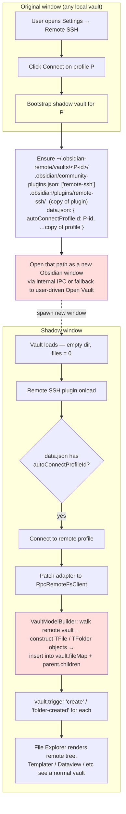
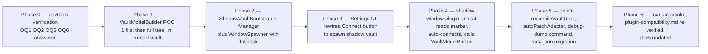

# Architecture: Shadow Vault Approach

**Status:** Design — not yet implemented
**Decided:** 2026-04-27
**Supersedes:** the monkey-patch-and-reconcile approach used through v0.4.3

## TL;DR

To deliver a VS Code Remote-SSH-like experience for Obsidian, we open the
remote vault as a **second Obsidian window** rooted at a local "shadow"
directory that's empty on disk but whose plugin loads the file model
from the remote daemon at startup. This replaces the in-place
`monkey-patch app.vault.adapter + reconcileVaultRoot` flow used through
v0.4.3, which is fundamentally blocked on this Obsidian build (see
**Why we pivoted** below).

The transport stack — `RpcRemoteFsClient`, `SftpRemoteFsClient`,
`ServerDeployer`, `ResourceBridge`, `ReconnectManager`, `JumpHostTunnel`,
`AuthResolver`, `HostKeyStore`, the Go daemon, `fs.watch` — is unchanged.
What gets replaced is the surface that connects the patched adapter to
Obsidian's vault model.

---

## 1. Why we pivoted

Through v0.4.3 the design was: user opens any local vault, clicks
Connect, the plugin monkey-patches `app.vault.adapter` to route through
`RpcRemoteFsClient`, then `reconcileVaultRoot()` walks the remote tree
and calls `app.vault.adapter.reconcileFile(path)` for every file so
Obsidian's vault model picks up the new contents.

PRs #52, #54, #57 each tried a variation of this. None of them work on
the user's Obsidian build (1.5+ era, FileSystemAdapter on desktop). The
2026-04-27 smoke session ran end-to-end devtools experiments and
established:

| API tried | Result on this build |
|---|---|
| `reconcileFile(vaultPath)` (PR #57) | subscriber throws `Cannot read properties of undefined (reading 'startsWith')` |
| `reconcileFile(getRealPath(vaultPath))` (constructed via Obsidian's own helper) | same throw |
| `reconcileFileInternal(vaultPath)` | different throw — `lastIndexOf of undefined` |
| `vault.generateFiles()` | returns an async iterator that does nothing useful for our purpose |
| `vault.load()` after clearing `vault.fileMap` | runs in 1.7s and completes, but rebuilds **zero** files; `vault.load()` does not walk the adapter |

Catastrophic-mismatch state from a real connect attempt:

- Adapter is patched and points at remote.
- Vault model still reflects local files (the reconcile attempts were
  no-ops: 0 added, 0 pruned).
- File Explorer therefore shows the local layout.
- Any read attempt — Templater scanning, Dataview indexing, the user
  clicking a file — flows through the patched adapter to remote, which
  doesn't have those local paths, producing an `unhandledrejection: no
  such file: …` storm.

Conclusion: Obsidian does not expose a public path to "rebuild the
vault model from a different adapter mid-session." The reconcile
methods exist but their event subscribers are coupled to internal state
the patched adapter can't satisfy after the vault has already been
constructed against a different basePath.

So we stop trying to update the vault in place, and instead spin up a
**fresh** vault whose adapter is set up from the very first read.

## 2. Architecture



Yellow = new component.
Red = open question / unverified mechanism (see §4).

## 3. Components

| Module | Status | Responsibility |
|---|---|---|
| `ShadowVaultBootstrap` | **new** | Materialise `~/.obsidian-remote/vaults/<profile-id>/` for a profile: ensure `.obsidian/`, install plugin (symlink on \*nix, copy on Windows), write `data.json` with the profile config and `autoConnectProfileId` marker. |
| `ShadowVaultManager` | **new** | High-level: given a profile, decide whether shadow vault already exists, bootstrap if not, then ask `WindowSpawner` to open it. |
| `WindowSpawner` | **new** | Wrap whatever Obsidian/Electron API actually opens a vault in a new window (see OQ1). Falls back to a modal that says "Click 'Open vault' and pick this folder" with the path pre-copied to clipboard if no programmatic path exists. |
| `VaultModelBuilder` | **new** | Inside the shadow window, after connect: walk the remote tree via `RpcRemoteFsClient.list()`, construct `TFile`/`TFolder` objects (or quack-typed equivalents — see OQ2), insert into `vault.fileMap` and the appropriate parent's `children` array, fire `vault.trigger('create', file)` per insert. |
| `RpcRemoteFsClient` | unchanged | Existing α (Go daemon) RPC transport. |
| `SftpRemoteFsClient` | unchanged | Existing direct-SFTP fallback. |
| `ServerDeployer` | unchanged | Auto-deploys the daemon (0.4.2 absolute paths + 0.4.3 suffix-pkill fixes both apply). |
| `ResourceBridge` | unchanged | localhost HTTP server for binaries, with Range support. |
| `ReconnectManager` | unchanged | Exp-backoff reconnect; runs inside the shadow window the same way. |
| `JumpHostTunnel`, `AuthResolver`, `HostKeyStore` | unchanged | All transport-layer, profile-driven. |
| `reconcileVaultRoot` (main.ts) | **delete** | Replaced by `VaultModelBuilder`. |
| `autoPatchAdapter` flow (Tier 1-A, PR #46) | **delete** | The shadow window patches its own adapter at onload; there's no "auto-patch on first connect" anymore — the shadow window IS the connect. |
| `debugDumpVaultAdapterAPI` (PR #54) | **delete** after pivot | Diagnostic served its purpose during the v0.4.x smoke. |

## 4. Open questions

These need to be answered before or during early-phase implementation.
Each has a concrete way to verify.

### OQ1 — How does Obsidian programmatically open a vault path in a new window?

**Risk:** High. If there's no public/internal API, the UX degrades to
"click Open Vault, pick this folder", which hurts the
remote-SSH-feels-magical effect.

**Verify:** In devtools, probe each candidate:

```js
console.log('app.openVault?',                typeof app.openVault);
console.log('app.openVaultByPath?',          typeof app.openVaultByPath);
console.log('window.electron?',              typeof window.electron);
// Plus: list electron's ipcRenderer channels if accessible.
console.log('command app:open-vault?',       !!app.commands.commands?.['app:open-vault']);
console.log('command workspace:open-vault?', !!app.commands.commands?.['workspace:open-vault']);
```

**Fallback if none exists:** `WindowSpawner` shows a modal with the
shadow vault path pre-copied to clipboard and a button that runs
`app.commands.executeCommandById('app:open-vault')` (which opens the
vault picker dialog). User picks the highlighted folder.

### OQ2 — Can we construct `TFile` / `TFolder` from the public `obsidian` module?

**Risk:** Medium. If the constructors throw or require properties we
can't supply, we have to construct quack-typed plain objects, and
plugin compatibility (`instanceof TFile` checks) gets fragile.

**Status (2026-04-27):** ✅ **Answered.** Constructor works with no
arguments; we then populate fields manually.

`require('obsidian')` is not available in the devtools console (the
`obsidian` module is only resolved inside the esbuild-bundled plugin
code), so the verification grabs the class via an existing instance:

```js
const TFile   = Object.getPrototypeOf(app.vault.getFiles()[0]).constructor;
const TFolder = Object.getPrototypeOf(app.vault.getRoot()).constructor;
const fake    = new TFile();   // succeeded, no throw
fake.vault    = app.vault;
fake.path     = 'POC-fake-file.md';
fake.name     = 'POC-fake-file.md';
fake.basename = 'POC-fake-file';
fake.extension= 'md';
fake.parent   = app.vault.getRoot();
fake.stat     = { ctime: Date.now(), mtime: Date.now(), size: 100 };
console.log(fake instanceof TFile);   // → true
```

So `VaultModelBuilder` will: construct via `new TFile()` / `new
TFolder()`, then populate `vault`, `path`, `name`, `basename`,
`extension`, `parent`, `stat` for files; `vault`, `path`, `name`,
`parent`, `children` for folders. From inside the bundled plugin we
import the classes the normal way (`import { TFile, TFolder } from
'obsidian'`) — only the devtools probe needs the prototype trick.

### OQ3 — Does inserting into `vault.fileMap` + firing `vault.trigger('create', file)` make File Explorer render and downstream plugins (Templater, Dataview) treat the file as real?

**Risk:** Medium. The "broken subscribers" we saw earlier listened to
`change`/`raw` events on the **adapter**, not `create` on the vault.
But we should verify they don't also listen to `create`.

**Status (2026-04-27):** ✅ **Answered for File Explorer.** The
mechanism works — File Explorer renders the injected file at root.
There is a **plugin-compat caveat** for plugins that bypass the
adapter and read files via Node `fs` directly; this is now
documented in §6.5 and is acceptable as a known limitation.

The minimal test (run on a real vault, no remote connection):

```js
// after constructing `fake` per OQ2 above
app.vault.fileMap[fake.path] = fake;
app.vault.getRoot().children.push(fake);
app.vault.trigger('create', fake);
```

Observed:

- `app.vault.getFiles()` includes the new file ✅
- `app.vault.getAbstractFileByPath('POC-fake-file.md')` returns it ✅
- File Explorer renders `POC-fake-file.md` at root ✅
- The earlier `iu`/`nu` storm-throwing subscribers (which were on
  adapter `change`/`raw`) did **not** fire ✅
- 2 subscriber errors fired during `create` from Omnisearch trying
  to `fs.readFile('<basePath>/POC-fake-file.md')` and getting
  ENOENT — see §6.5 for handling.

**Open click-to-open:** the test was run on a disconnected vault, so
clicking the injected file failed (no patched adapter, file does not
exist on disk). We expect that with a patched adapter pointing at
remote, `vault.read()` → `adapter.read()` → remote round-trip will
succeed. To be re-verified during Phase 1.

### OQ4 — Plugin install in shadow vault: symlink vs copy?

**Risk:** Low. Mostly a Windows-vs-\*nix split.

**Verify:** Try `fs.symlink` from a Node-side script on each platform.
On Windows it usually fails without admin or developer mode; fall back
to recursive copy. Document this in `ShadowVaultBootstrap`.

### OQ5 — When the same profile's `data.json` is opened by two windows (original + shadow), do edits in one window race with the other?

**Risk:** Medium. Worst case the user changes a profile in the
original window's settings tab while the shadow window's plugin is
mid-flight reading the same file.

**Resolution candidate:** Shadow window treats `data.json` as read-only
after loading the marker — it never writes back. All profile edits
flow through the original window only. The shadow window listens for
`data.json` changes via Obsidian's own config-reload events and
re-reads, but only for non-destructive fields (e.g., `transport`
change → reconnect; profile delete → close shadow window).

### OQ6 — What does Obsidian write to a fresh vault directory when first opened?

**Risk:** Low.

**Verify:** Make an empty dir, open it as vault, observe what files
land in `.obsidian/`. We need to know which we should pre-create
(`community-plugins.json`, plugin folder) and which Obsidian creates
itself (`workspace.json`, `app.json`, etc.) so bootstrap doesn't
double-write.

## 5. Phased implementation plan



Each phase is 1–3 PRs, ~8–15 PRs total, comparable in scope to the
Tier 1+2 roadmap that landed through v0.4.3.

### Phase 0 deliverable

A devtools session that records the answers to OQ1, OQ2, OQ3, OQ6. The
answers update the corresponding sections of this document. No code
ships from Phase 0.

### Phase 1 deliverable

A PR that adds `VaultModelBuilder` with unit tests, plus a hidden
debug command "Remote SSH: Debug: build vault model from remote (POC)"
that runs the builder against an already-connected RPC session and
reports how many files actually appeared in `app.vault.getFiles()`. No
shadow vault yet — proof that the model-build half works in isolation.

### Phases 2 — 6

Sketched in §5 diagram; each phase's contract (inputs / outputs /
tests / smoke steps) gets fleshed out before its first PR.

## 6. Backwards compatibility

Pre-1.0, so we don't promise stability across this pivot.

- **Removed**: `data.json:autoPatchAdapter` setting (Tier 1-A). The
  shadow vault always-on model replaces it.
- **Preserved**: every profile field — `host`, `port`, `username`,
  `authMethod`, `privateKeyPath`, `transport`, `remotePath`,
  `connectTimeoutMs`, `keepaliveIntervalMs`, `keepaliveCountMax`,
  `clientId`, `userName`, `reconnectMaxRetries`,
  `rpcSocketPath`/`rpcTokenPath`, `jumpHost`, `hostKeyStore`. All used
  by the transport stack which doesn't change.
- **Settings UI**: the Connect button's behaviour changes from
  in-place patch to "open in new window". Add one-line copy in the
  profile row explaining this so existing users aren't surprised.
- **Migration**: on first 0.5.0 load, drop `autoPatchAdapter` from
  `data.json` if present. Otherwise no rewrite needed.

### 6.5 Plugin compatibility — `fs`-direct readers

The OQ3 verification surfaced a class of plugins that read file
contents via Node's `fs.promises.readFile` directly against the local
basePath, instead of going through `app.vault.read()` /
`app.vault.cachedRead()`. The minimal-test injection of
`POC-fake-file.md` triggered Omnisearch to attempt
`fs.readFile('<vault-basePath>/POC-fake-file.md')` and log
`ENOENT: no such file or directory` (twice — once for its live cache,
once for indexing).

In the shadow-vault world this matters because the shadow vault's
basePath on disk has **only** `.obsidian/` — none of the actual files.
Any plugin that bypasses the adapter and reads via `fs` will see ENOENT
for every file in the model.

**Triage rule for the plugin-compatibility matrix:**

- Plugins that read via `app.vault.read()` / `cachedRead()` work
  unchanged (Templater, Dataview core, the file editor, link
  resolution, etc.).
- Plugins that hit `fs` directly (Omnisearch, possibly some media
  indexers) cannot be made to work without mirroring the file content
  to a real local path. Mark these `❌ broken (fs-direct)` in
  [docs/plugin-compatibility.md](plugin-compatibility.md), with a
  one-line note pointing here.
- A future enhancement (out of scope for the initial pivot) could
  shadow-write actual file content to the local basePath as a
  read-only mirror for these plugins. Big disk cost, defer until the
  base architecture is stable.

For Phase 1 we accept this limitation; Phase 6's smoke pass walks the
existing 11 plugins in the matrix and re-categorises each.

## 7. Glossary

| Term | Meaning here |
|---|---|
| **Shadow vault** | A directory `~/.obsidian-remote/vaults/<profile-id>/` containing only `.obsidian/`, used as a vault root by Obsidian to give us a clean window to populate from remote. |
| **Original window** | The Obsidian window the user clicked Connect from. Holds whatever local vault they were in. Stays untouched by Connect. |
| **Shadow window** | The new Obsidian window opened on the shadow vault path. Hosts the patched adapter and the live RPC session. |
| **Profile P** | The `SshProfile` the user clicked Connect on. Identified by its `id`. |
| **Auto-connect marker** | A field `autoConnectProfileId` in the shadow vault's `data.json`, telling the plugin in the shadow window which profile to connect to at onload. |

## 8. References

- Plan file: `C:\Users\souta\.claude\plans\self-archive-obsidian-staged-nova.md` — handoff snapshot, will be rewritten when this design lands.
- Diagnostic dump command (`Remote SSH: Debug: dump adapter / vault API surface`) was used 2026-04-27 to inventory `app.vault.adapter` methods on the maintainer's Obsidian build — see PR #54.
- Smoke transcript that drove this pivot: 2026-04-27 session, console.log generations 1–3 in `<vault>/.obsidian/plugins/remote-ssh/`.
- Past in-place-reconcile attempts (will be removed): PR #46 (autoPatchAdapter), PR #52 (broken reconcileFolder call), PR #54 (debug dump + multi-hook fallback), PR #57 (per-file walk).
