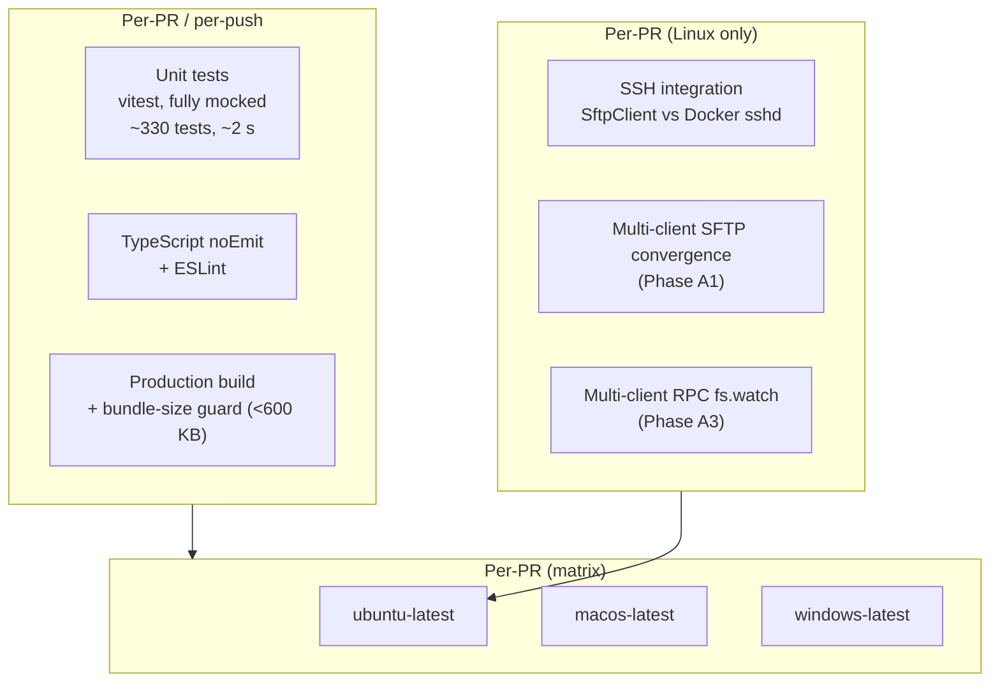
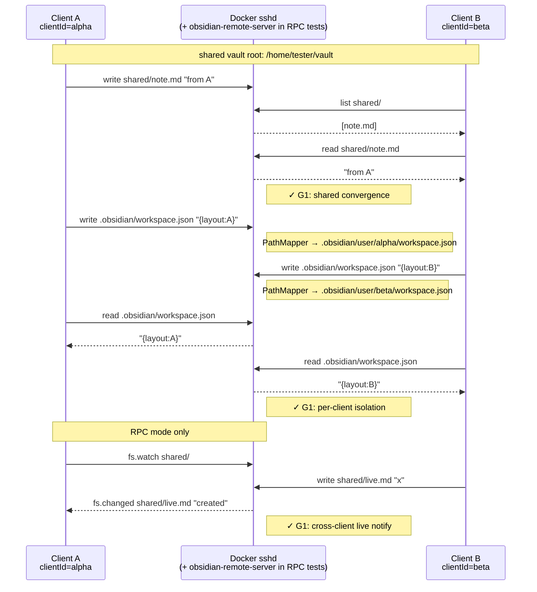
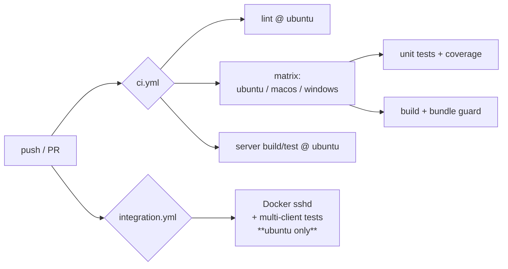

# Testing strategy

This document records the test architecture for `obsidian-remote-ssh`,
adopted in v0.4.19 (Phase A) and v0.4.22 (Phase B). It complements
[architecture-shadow-vault.md](./architecture-shadow-vault.md) — the
shadow-vault flow is what we test; this doc explains *how*.

## Goals

- **G1** — Two clients editing the same remote vault don't break each
  other: shared content converges, per-client UI state stays isolated.
- **G2** — The plugin builds and unit-tests pass on every desktop OS
  Obsidian itself ships on (Linux / macOS / Windows).

## Layers

`Local` runs on the matrix. `Container` runs only on `ubuntu-latest`
because Linux containers aren't available on macOS / Windows GitHub
runners.

## Phase A — Multi-client convergence

The shadow-vault model assumes a user can have several Obsidian
instances pointed at the same remote vault and they will not corrupt
each other. The integration tests in `plugin/tests/integration/`
exercise that assumption against a real `sshd` running in Docker.

### Sequence under test

### Test files

| File | What it covers | Phase |
|---|---|---|
| `plugin/tests/integration/ssh.integration.test.ts` | `SftpClient` raw protocol round-trips. *Pre-A baseline.* | — |
| `plugin/tests/integration/multiclient.sftp.test.ts` | Two `SftpDataAdapter` instances over SFTP: shared write/read, PathMapper isolation, delete/rename convergence. | A1 |
| `plugin/tests/integration/multiclient.rpc.test.ts` | The same scenarios over the RPC transport, plus `fs.watch` cross-client notifications. | A3 |
| `plugin/tests/integration/helpers/makeAdapter.ts` | Factory that builds a fully-wired `SftpDataAdapter` for a given clientId. | A1 |
| `plugin/tests/integration/helpers/deployDaemonOnce.ts` | `describe`-scoped helper that builds + deploys the Go daemon to the test sshd container so RPC tests can talk to it. Runtime deploy via `ServerDeployer`, same code path as production. | A2 |

The pre-existing `npm run test:integration` script picks up everything
under `tests/integration/` automatically — no new vitest config is
required.

### Daemon deploy strategy

For RPC tests we **deploy the daemon at runtime via `ServerDeployer`**
rather than baking it into the docker image. Trade-offs:

- **Pro**: same code path as production, image rebuild isn't required
  when the daemon changes, the test catches deploy-time regressions.
- **Con**: each integration run spends ~1 s on the upload + chmod +
  start dance. Acceptable.

The Go binary is built once before the integration suite runs (CI step
`npm run build:server`) and lives at the path the production code
already knows about (`server-bin/obsidian-remote-server-linux-amd64`).

## Phase B — Multi-OS matrix

`ci.yml` runs `test` and `build` jobs on ubuntu / macos / windows.
`lint` and `server build/test` stay ubuntu-only (lint is OS-neutral by
construction; the server is a Linux binary).

### What we expect each runner to catch

| OS | Likely-caught classes of bug |
|---|---|
| ubuntu | Baseline. `node:fs` calls, ssh2 quirks, daemon deploy. |
| macos | Path case-sensitivity (HFS+ default-insensitive), `node:os.hostname()` differences. |
| windows | `path.sep === '\\'`, symlink fallback in `ShadowVaultBootstrap.installPlugin` (Developer mode off → expect copy, not symlink), CRLF/LF in test fixture files. |

### Out of scope for B

- Cross-OS multi-client integration (macOS client + Windows client
  editing the same remote). Defer until shadow-vault has real users
  asking for it; the cost is high (macOS runner billing) and the bug
  detection is largely subsumed by Phase A1+A3 + Phase B.
- Mobile (iOS / Android). The plugin is `isDesktopOnly: true`; mobile
  is a future scoping decision, not a CI gap.

## Authoring conventions

- Integration tests must be safe to run on a developer's laptop with a
  freshly-`npm run sshd:start`'d container; no test should require
  external state, and every test must clean its own files in
  `afterAll`.
- Each test file gets a unique subdir under `/home/tester/vault/`
  (`integration-${stamp}`) so parallel test files can run without
  trampling each other. Within a file, vitest is configured for
  serial execution (`fileParallelism: false`).
- Helper files live under `plugin/tests/integration/helpers/`;
  factories take a `clientId` argument so tests can describe two-party
  scenarios concisely.
